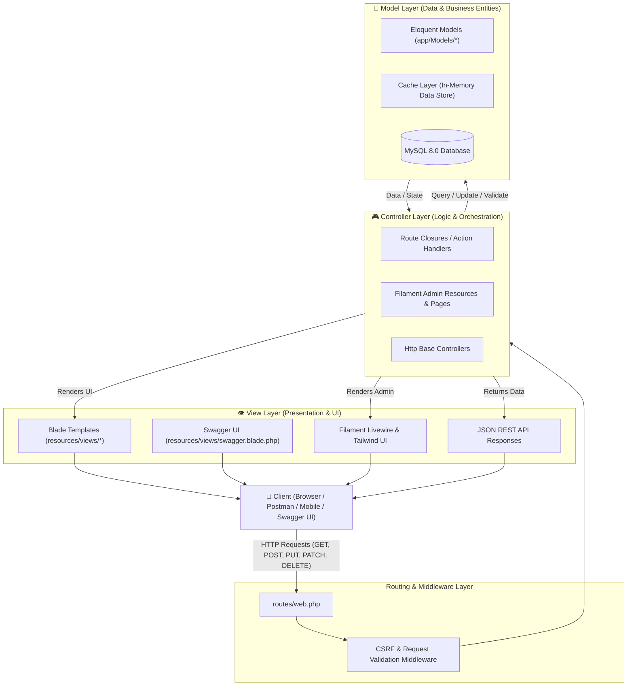

# 🎓 Alumni Tracking System


A modern, full-featured **Alumni Tracking System** built for universities, faculties, and educational institutions to foster sustainable relationships with graduates, monitor career progression, and cultivate an active alumni community.

---

## 🚀 About The Project

This application is built with the robust **Laravel 11** framework, a high-performance **Filament v3** administration panel, a scalable **MySQL** database, and is fully containerized using **Docker & Docker Compose** for seamless local development and deployment.

### 🌟 Key Features

- **👥 Role-Based Access Control (RBAC):**
  - **Super Admin:** Full system control, department/faculty management, access configuration.
  - **Department Coordinator:** Monitor, verify, and report alumni records belonging to their department.
  - **Alumni:** Update profiles, manage work experience, browse/post job openings, and network with peers.
- **🛡️ Alumni Verification Workflow:**
  - Student ID & graduation verification with manual or automatic administrator approval states.
- **💼 Career & Job Board:**
  - Job and internship posting board managed by alumni and institution coordinators, with direct application support.
- **🔍 Advanced Search & Filtering:**
  - Instantly search and filter graduates by graduation year, faculty, department, industry, current company, and location.
- **📊 Modern Dashboard (Filament v3):**
  - Interactive statistic widgets (total alumni, employment rate, leading industries).
  - Bulk data exports (CSV, Excel, PDF).
- **📅 Events & Announcements:**
  - Organize alumni reunions, webinars, panels, and networking meetups with RSVP tracking.
- **🐳 Dockerized Architecture:**
  - Isolated environment for PHP 8.2+, Nginx, MySQL, and Redis managed via Docker Compose.

---

## 🛠️ Tech Stack

| Layer | Technology | Description |
| :--- | :--- | :--- |
| **Containerization** | Docker & Docker Compose | Containerized application and database services |
| **Backend** | PHP 8.2+ & Laravel 11.x | Modern MVC architecture, RESTful API, Eloquent ORM |
| **Admin Panel** | Filament v3 | TALL stack powered (Tailwind, Alpine.js, Laravel, Livewire) admin UI |
| **Database** | MySQL 8.x | High-performance relational database model |
| **Styling & UI** | Tailwind CSS & Livewire | Clean, responsive, and reactive front-end interface |
| **Authorization** | Spatie Laravel-Permission / Filament Shield | Granular role and permission management |

---

## 📋 Prerequisites

Ensure you have the following installed on your host machine:

* **[Docker Desktop](https://www.docker.com/products/docker-desktop/)** (Docker Engine & Docker Compose v2+)
* **Git**

*(Optional if running locally without Docker: PHP >= 8.2, Composer >= 2.x, Node.js >= 18)*

---

## 🐳 Docker Compose Quickstart (Recommended)

Running the project with Docker ensures that all dependencies (PHP, MySQL, extensions) run in isolated containers without needing local installations.

### 1. Clone the Repository
```bash
git clone https://github.com/gamze-sueda-akpinar/alumni.git
cd alumni
```

### 2. Environment Configuration
Copy `.env.example` to create your local `.env` file:
```bash
cp .env.example .env
```

Ensure your `.env` contains the matching Docker database service configurations:
```env
DB_CONNECTION=mysql
DB_HOST=mysql
DB_PORT=3306
DB_DATABASE=alumni_db
DB_USERNAME=alumni_user
DB_PASSWORD=alumni_secret
```

### 3. Build & Start Containers
Launch the application and database containers in detached mode:
```bash
docker compose up -d --build
```

### 4. Install Dependencies
Run Composer and NPM within the running application container:
```bash
docker compose exec app composer install
docker compose exec app npm install
docker compose exec app npm run build
```

### 5. Application Setup & Migrations
Generate application key, link storage, and run database migrations:
```bash
docker compose exec app php artisan key:generate
docker compose exec app php artisan storage:link
docker compose exec app php artisan migrate --seed
```

### 6. Create Filament Admin Account
Create your administrative credentials to log in to the Filament panel:
```bash
docker compose exec app php artisan make:filament-user
```
*(Enter your Name, Email, and Password when prompted)*

### 7. Access the Application
Open your browser and navigate to:
* **Public Web Portal:** `http://localhost:8000`
* **Filament Admin Panel:** `http://localhost:8000/admin`

---

## 💻 Alternative: Local Setup (Without Docker)

If you prefer to run the application directly on your local system with **PHP, Composer, Node.js, and MySQL** installed:

```bash
# 1. Install dependencies
composer install
npm install

# 2. Setup environment & key
cp .env.example .env
php artisan key:generate

# 3. Migrate and seed
php artisan migrate --seed
php artisan storage:link

# 4. Create admin user
php artisan make:filament-user

# 5. Build assets and start server
npm run build
php artisan serve
```

---

## 🗄️ Database Schema Overview

The database architecture is structured around key relational entities:

```text
├── users (Authentication, credentials, and core user attributes)
├── roles & permissions (RBAC permission matrix)
├── faculties (Faculties and academic units)
├── departments (Academic departments linked to faculties)
├── alumni_profiles (Graduation year, student ID, status, contact details)
├── experiences (Work and internship history)
├── job_postings (Career opportunities and requirements)
├── job_applications (Job applications submitted by alumni)
└── events (Reunions, workshops, and networking announcements)
```

---

## 🏗️ MVC (Model-View-Controller) Architecture

This application is engineered using **Laravel 11** adhering to the industry-standard **Model-View-Controller (MVC)** architectural pattern, integrated with **Filament v3** (TALL Stack) and a dedicated **RESTful API & Swagger Documentation Layer**.



### 1. 🧠 Model (M) — Data Structures, Relationships & Business Rules
The **Model** layer encapsulates data schema, database interaction, business rules, and entity relationships using Laravel's **Eloquent ORM**:

* **[`app/Models/User.php`](app/Models/User.php):** Core authentication and user management entity. Represents administrators, department coordinators, and alumni.
* **[`app/Models/InMemoryUser.php`](app/Models/InMemoryUser.php):** Non-database standalone User Model providing full CRUD operations (`all()`, `find($id)`, `create($data)`, `update($id, $data)`, `delete($id)`) via in-memory caching.
* **[`app/Models/UserModel.php`](app/Models/UserModel.php):** Extended alias for the non-database User Model.
* **[`app/Models/AlumniProfile.php`](app/Models/AlumniProfile.php):** Core alumni data model containing graduation year, student number, approval status, city, current company, and position. Belongs to `User` and `Department`.
* **[`app/Models/Faculty.php`](app/Models/Faculty.php):** Academic faculties (e.g., Faculty of Engineering). Has a one-to-many relationship with `Department`.
* **[`app/Models/Department.php`](app/Models/Department.php):** Academic departments (e.g., Computer Engineering, MIS). Belongs to `Faculty` and has many `AlumniProfile` records.
* **[`app/Models/Experience.php`](app/Models/Experience.php):** Tracks professional career history, internship records, and current employment for graduates.
* **[`app/Models/JobPosting.php`](app/Models/JobPosting.php):** Career openings, internships, and job advertisements shared for alumni.
* **[`app/Models/Event.php`](app/Models/Event.php):** Reunions, seminars, conferences, and networking events for graduates.
* **`database/migrations/`:** Database blueprint definitions establishing foreign keys, constraints, and table columns in MySQL.

### 2. 👁️ View (V) — Presentation & User Interfaces
The **View** layer handles presenting data to users, structuring layouts, and rendering interactive front-end screens:

* **Blade Templates ([`resources/views/`](resources/views/)):**
  * **[`resources/views/users/index.blade.php`](resources/views/users/index.blade.php):** Web user directory & listing view (`GET /users` — Read) with responsive table, action buttons (Show, Edit, Delete), and quick creation form (`POST /users` — Create).
  * **[`resources/views/users/show.blade.php`](resources/views/users/show.blade.php):** Detailed single user profile view (`GET /users/{id}` — Read Single) with edit and delete actions.
  * **[`resources/views/users/edit.blade.php`](resources/views/users/edit.blade.php):** User profile editing form view (`GET /users/{id}/edit` — Update Form) with `@method('PUT')`.
  * **[`resources/views/users/create.blade.php`](resources/views/users/create.blade.php):** Dedicated user registration form view (`GET /users/create` — Create Form).
  * **[`resources/views/main.blade.php`](resources/views/main.blade.php):** Responsive, modern landing and home page designed with Tailwind CSS, featuring alumni success highlights and navigation.
  * **[`resources/views/about.blade.php`](resources/views/about.blade.php):** About page presenting the purpose and vision of the Alumni Tracking System.
  * **[`resources/views/swagger.blade.php`](resources/views/swagger.blade.php):** Embedded, interactive **Swagger UI 5.x** interface for live API exploration and testing directly in the browser.
  * **[`resources/views/welcome.blade.php`](resources/views/welcome.blade.php):** Default framework landing template.
* **Filament v3 Admin Panel UI:**
  * Powered by the **TALL stack** (Tailwind CSS, Alpine.js, Laravel, Livewire). Renders reactive administration dashboards, data tables, filter modals, and statistics cards without writing manual HTML.

### 3. 🎮 Controller (C) — Request Handling & Flow Control
* **Web & API Controllers ([`app/Http/Controllers/`](app/Http/Controllers/)):**
  * **[`app/Http/Controllers/UserController.php`](app/Http/Controllers/UserController.php):** Web/Resource controller handling full CRUD lifecycle methods (`index`, `create`, `store`, `show`, `edit`, `update`, `destroy`) with view and JSON response support.
  * **[`app/Http/Controllers/ApiUserController.php`](app/Http/Controllers/ApiUserController.php):** Dedicated RESTful JSON controller managing the API CRUD operations (`index`, `store`, `show`, `update`, `destroy`) powered by the `InMemoryUser` model.
  * **[`app/Http/Controllers/Api/ApiUserController.php`](app/Http/Controllers/Api/ApiUserController.php):** Namespaced API controller alias for modular route binding.
  * **[`app/Http/Controllers/Controller.php`](app/Http/Controllers/Controller.php):** Base Laravel foundation controller class.
* **Application Routes ([`routes/web.php`](routes/web.php)):**
  * Serves front-end Blade views (`/`, `/main`, `/about`, `/hello/{name}`).
  * Directs resource requests to `UserController` (`/users`) and RESTful endpoints to `ApiUserController` (`/api/users`).
* **Filament Admin Resources ([`app/Filament/Resources/`](app/Filament/Resources/)):**
  * High-level CRUD controller classes (`AlumniProfileResource`, `DepartmentResource`, `FacultyResource`, `JobPostingResource`, `EventResource`) managing form schemas, table columns, queries, and permissions.

---

## 📂 Project Directory & File Structure

A detailed map of the directories, folders, and key files comprising the **Alumni Tracking System**:

```text
alumni/
├── app/                                    # Core application codebase
│   ├── Filament/                           # Filament v3 Admin Panel modules
│   │   ├── Resources/                      # Administrative CRUD resources
│   │   │   ├── AlumniProfileResource.php   # Alumni profile manager & table/form definitions
│   │   │   ├── AlumniProfileResource/Pages # Create, Edit, List lifecycle pages
│   │   │   ├── DepartmentResource.php      # Department manager & definitions
│   │   │   ├── DepartmentResource/Pages    # Create, Edit, List lifecycle pages
│   │   │   ├── EventResource.php           # Event manager & definitions
│   │   │   ├── EventResource/Pages         # Create, Edit, List lifecycle pages
│   │   │   ├── FacultyResource.php         # Faculty manager & definitions
│   │   │   ├── FacultyResource/Pages       # Create, Edit, List lifecycle pages
│   │   │   ├── JobPostingResource.php      # Job board manager & definitions
│   │   │   └── JobPostingResource/Pages    # Create, Edit, List lifecycle pages
│   │   └── Widgets/                        # Admin dashboard analytic widgets
│   │       └── StatsOverview.php           # Quick metrics (total alumni, stats)
│   ├── Http/                               # HTTP layer
│   │   └── Controllers/                    # HTTP Controllers (Controller layer)
│   │       ├── Api/                        # API Controllers namespace
│   │       │   └── ApiUserController.php   # Namespaced REST API Controller
│   │       ├── ApiUserController.php       # JSON RESTful API CRUD Controller
│   │       ├── Controller.php              # Base Laravel controller
│   │       └── UserController.php          # Web & Resource CRUD Controller
│   ├── Models/                             # Eloquent ORM & In-Memory Models (Model layer)
│   │   ├── AlumniProfile.php               # Alumni graduate profile entity
│   │   ├── Department.php                  # Academic department entity
│   │   ├── Event.php                       # Alumni reunions & events entity
│   │   ├── Experience.php                  # Professional career history entity
│   │   ├── Faculty.php                     # Faculty entity
│   │   ├── InMemoryUser.php                # Non-database User Model with full CRUD
│   │   ├── JobPosting.php                  # Career opportunity entity
│   │   ├── User.php                        # Core user authentication entity
│   │   └── UserModel.php                   # Database-independent User model alias
│   └── Providers/                          # Service providers
│       ├── AppServiceProvider.php          # Application bootstrap services
│       └── Filament/                       # Filament panel providers
│           └── AdminPanelProvider.php      # Filament dashboard configuration & colors
├── bootstrap/                              # Framework initialization
│   ├── app.php                             # Middleware pipeline, CSRF exemptions (api/*)
│   └── providers.php                       # Application service provider registry
├── config/                                 # Global application configuration
│   ├── app.php                             # Timezone, locale, application keys
│   ├── auth.php                            # Authentication guards & providers
│   ├── cache.php                           # Caching stores (database, file, redis)
│   ├── database.php                        # MySQL & Redis database connection settings
│   └── ...                                 # Logging, session, mail configurations
├── database/                               # Database migrations, seeders & factories
│   ├── factories/                          # Dummy data factories for testing
│   ├── migrations/                         # Database schema table definitions
│   │   ├── 0001_01_01_000000_create_users_table.php
│   │   ├── 2026_09_23_073223_create_faculties_table.php
│   │   ├── 2026_09_23_073231_create_departments_table.php
│   │   ├── 2026_09_23_073240_create_alumni_profiles_table.php
│   │   ├── 2026_09_23_073248_create_experiences_table.php
│   │   ├── 2026_09_23_073258_create_job_postings_table.php
│   │   └── 2026_09_23_073306_create_events_table.php
│   └── seeders/                            # Database seeders
│       └── DatabaseSeeder.php              # Initial seed data for faculties & admin
├── docker/                                 # Container configuration files
│   ├── nginx/                              # Nginx reverse proxy service
│   │   └── default.conf                    # Nginx server block (listening on 80 & 8000)
│   └── php/                                # PHP service configuration
│       └── local.ini                       # Custom PHP directives (memory, upload sizes)
├── public/                                 # Public web server document root
│   ├── index.php                           # Web server entry point
│   ├── openapi.json                        # OpenAPI 3.0 specification for Swagger UI
│   ├── robots.txt                          # Search engine bot instructions
│   └── .htaccess                           # Apache URL rewrite rules
├── resources/                              # Front-end view templates and assets (View layer)
│   ├── css/                                # Tailwind and CSS stylesheets
│   ├── js/                                 # JavaScript front-end assets
│   └── views/                              # Blade templates
│       ├── users/                          # User CRUD View Layer
│       │   ├── create.blade.php            # New user creation form (GET /users/create -> POST /users)
│       │   ├── edit.blade.php              # User edit form (GET /users/{id}/edit -> PUT /users/{id})
│       │   ├── index.blade.php             # User directory & listing table (GET /users)
│       │   └── show.blade.php              # Single user profile view (GET /users/{id})
│       ├── about.blade.php                 # Informational About Us view
│       ├── main.blade.php                  # Public Home/Main portal view
│       ├── swagger.blade.php               # Interactive Swagger UI view
│       └── welcome.blade.php               # Framework default view
├── routes/                                 # Application routing definitions (Controller layer)
│   ├── console.php                         # Artisan CLI custom console commands
│   └── web.php                             # Web routes, REST API routes, Swagger routes
├── storage/                                # Compiled templates, sessions, logs, file uploads
│   ├── app/                                # Application storage & files
│   ├── framework/                          # Framework cache, sessions, views
│   └── logs/                               # Laravel runtime logs (laravel.log)
├── tests/                                  # Automated tests
│   ├── Feature/                            # Feature & integration tests
│   └── Unit/                               # Unit tests
├── .env.example                            # Example environment variables
├── .gitignore                              # Git version control ignore rules
├── docker-compose.yml                      # Multi-container orchestration (App, Web, MySQL, PMA)
├── Dockerfile                              # Custom PHP 8.3-FPM + Composer + Node container
├── composer.json                           # PHP packages & autoload mapping
├── package.json                            # NPM dependencies & front-end scripts
└── README.md                               # Complete project documentation & guide
```

---

## 📡 RESTful API & Interactive Swagger Documentation

The application provides a comprehensive RESTful API for alumni management. An interactive **Swagger UI** is integrated at `/api/swagger`, powered by an **OpenAPI 3.0** specification at `/api/swagger.json`.

### 🔗 Available Endpoints (Web & API Controllers)

#### 🌐 RESTful API Endpoints (`ApiUserController` — `/api/users`)
| Method | Endpoint | Controller Action | Description | Query / Body | Response Code |
| :---: | :--- | :--- | :--- | :--- | :---: |
| **`GET`** | `/api/health` | Closure | Check API status & MySQL connectivity | None | `200 OK` |
| **`GET`** | `/api/users` | `ApiUserController@index` | List all alumni users as JSON | None | `200 OK` |
| **`POST`** | `/api/users` | `ApiUserController@store` | Register new alumni user (JSON) | JSON (`name`, `email`, ...) | `201 Created` |
| **`GET`** | `/api/users/{id}` | `ApiUserController@show` | Get single user JSON by ID | URL Path (`id`) | `200 OK` / `404` |
| **`PUT`** | `/api/users/{id}` | `ApiUserController@update`| Complete update of user profile | URL Path + Full JSON | `200 OK` / `404` |
| **`PATCH`**| `/api/users/{id}` | `ApiUserController@update`| Partial update of user attributes | URL Path + Partial JSON | `200 OK` / `404` |
| **`DELETE`**| `/api/users/{id}` | `ApiUserController@destroy`| Delete user record from system | URL Path (`id`) | `200 OK` / `404` |

#### 🖥️ Web / Resource Controller Endpoints (`UserController` — `/users`)
| Method | Endpoint | Controller Action | Description | Response Type |
| :---: | :--- | :--- | :--- | :---: |
| **`GET`** | `/users` | `UserController@index` | Display users list / view | View / JSON (`200 OK`) |
| **`GET`** | `/users/create` | `UserController@create` | Show user creation form | View (`users.create`) |
| **`POST`** | `/users` | `UserController@store` | Store new user record | Redirect / JSON (`201`) |
| **`GET`** | `/users/{id}` | `UserController@show` | Display single user details | View / JSON (`200 OK`) |
| **`GET`** | `/users/{id}/edit`| `UserController@edit` | Show user edit form | View (`users.edit`) |
| **`PUT`** | `/users/{id}` | `UserController@update` | Update existing user record | Redirect / JSON (`200`) |
| **`DELETE`**| `/users/{id}` | `UserController@destroy`| Delete user record | JSON / Redirect |

#### 📖 Documentation Endpoints
| Method | Endpoint | Description | Response Type |
| :---: | :--- | :--- | :---: |
| **`GET`** | `/api/swagger` | Interactive Swagger UI in browser | HTML (`200 OK`) |
| **`GET`** | `/api/swagger.json` | Download OpenAPI 3.0 JSON specification | JSON (`200 OK`) |

### 🚀 Accessing Swagger UI
Simply navigate to:
* **[http://localhost/api/swagger](http://localhost/api/swagger)** *(or `http://localhost:8000/api/swagger`)*

Click **"Try it out"** on any endpoint to test requests directly in your browser without needing external tools.

---

## 📸 Screenshots

> *Screenshots will be updated as modules are finalized.*

| Filament Admin Dashboard | Alumni Directory & Search |
| :---: | :---: |
| *(Dashboard Preview)* | *(Directory Preview)* |

---

## 🤝 Contributing

Contributions are welcome!

1. Fork the repository (`Fork` button on GitHub).
2. Create your feature branch (`git checkout -b feature/AmazingFeature`).
3. Commit your changes (`git commit -m 'feat: Add some amazing feature'`).
4. Push to the branch (`git push origin feature/AmazingFeature`).
5. Open a **Pull Request**.

---

## 📄 License

This project is open-sourced under the [MIT License](LICENSE).

---

## 👤 Contact

**Gamze Şüeda Akpınar**  
* GitHub: [@gamze-sueda-akpinar](https://github.com/gamze-sueda-akpinar)  
* Project Link: [https://github.com/gamze-sueda-akpinar/alumni](https://github.com/gamze-sueda-akpinar/alumni)
